# KVStore System Design

## Overview

This is a KV store inspired by Redis, with support for failover via a Raft implementation. This project serves as a
learning platform for Java, distributed systems, and systems design. The project uses one external dependency: `jackson`
for JSON deserialization.

### Deployment Modes

The KVStore supports two deployment modes:

| Mode             | Command                                | Description                                          |
|------------------|----------------------------------------|------------------------------------------------------|
| **Single-Node**  | `run -h <host> -p <port>`              | Standalone server with direct command execution      |
| **Raft Cluster** | `raft -f <config-file> --id <node-id>` | Distributed cluster with consensus-based replication |

### Supported Commands

| Command             | Description           | Raft Consensus          |
|---------------------|-----------------------|-------------------------|
| `GET <key>`         | Retrieve value by key | No (direct read)        |
| `PUT <key> <value>` | Store key-value pair  | Yes (requires majority) |

---

## Architecture

### Core Engine

The core engine is designed for high throughput and low latency, with two key optimizations:

#### Incremental Rehashing

To bypass the "stop the world" map resizes, the KVStore implements gradual resizing inspired
by [Redis](https://github.com/redis/redis/blob/unstable/src/dict.h) and separate chaining for handling hash collisions.

When resizing the underlying array to accommodate more keys, instead of moving all keys into the new array at once, a
portion of keys are moved from `ht1` to `ht2` upon each interaction. This is a much more scalable solution compared to
the default implementation within Java, which would force the program to halt causing latency spikes and drops in
throughput.

```
┌─────────────────────────────────────────────────────────────┐
│                      KVMap Rehashing                         │
├─────────────────────────────────────────────────────────────┤
│                                                              │
│   ht1 (old)              ht2 (new, larger)                  │
│   ┌───────────┐          ┌───────────────────┐              │
│   │ bucket 0  │ ───────► │ bucket 0          │              │
│   │ bucket 1  │          │ bucket 1          │              │
│   │ ...       │          │ ...               │              │
│   │ bucket N  │          │ bucket M (M > N)  │              │
│   └───────────┘          └───────────────────┘              │
│                                                              │
│   rehashIdx tracks progress                                 │
│   Each GET/PUT moves REHASH_BUCKETS entries                 │
│                                                              │
└─────────────────────────────────────────────────────────────┘
```

#### Write-Ahead Logging (WAL) & Snapshotting

Upon each operation, a log entry is made describing the operation, containing all parameters used. This is used during
the restoration process. Snapshotting is done periodically based on the number of commands processed to prevent
ever-growing logs and reduce start-up time when the store is being restored.

```
┌─────────────────────────────────────────────────────────────┐
│                    Durability Pipeline                       │
├─────────────────────────────────────────────────────────────┤
│                                                              │
│   Command ──► Log to WAL ──► Apply to KVMap ──► Response    │
│                 │                                            │
│                 ▼                                            │
│           [log file]                                        │
│                 │                                            │
│                 │ (when logCount >= threshold)               │
│                 ▼                                            │
│           [snapshot file]                                   │
│                 │                                            │
│                 ▼                                            │
│           Reset WAL                                          │
│                                                              │
└─────────────────────────────────────────────────────────────┘
```

---

### Raft Consensus

**Paper
**: [In Search of an Understandable Consensus Algorithm](https://classpages.cselabs.umn.edu/Spring-2018/csci8980/Papers/Consensus/Raft.pdf)

As per the official Raft paper, a node can either be a follower or leader. Leaders are in charge of replicating commands
to followers and returning responses to clients. Followers are responsible for receiving these requests to replicate
state and applying them, along with handling the election process when the leader goes down.

#### Terminology Mapping

| Raft Paper Term | Code Term      | Description                                      |
|-----------------|----------------|--------------------------------------------------|
| Follower        | **Broker**     | Receives and applies replicated commands         |
| Leader          | **Controller** | Accepts client commands, coordinates replication |
| Candidate       | **Candidate**  | Transitional state during election               |

#### RaftManager: The Coordinator

The `RaftManager` is the coordinator. It maintains:

- Clients connected to brokers and/or controller depending on the node's role
- The node's server (instantiated once, handler replaced on role switch)

Each handler provides common methods for handling events within an NIO server.

```
┌─────────────────────────────────────────────────────────────┐
│                    RaftManager Roles                         │
├─────────────────────────────────────────────────────────────┤
│                                                              │
│   BROKER (Follower)          CONTROLLER (Leader)            │
│   ┌─────────────────┐        ┌─────────────────┐            │
│   │ RaftBroker      │        │ RaftController  │            │
│   │ ServerHandler   │        │ ServerHandler   │            │
│   └────────┬────────┘        └────────┬────────┘            │
│            │                          │                      │
│            ▼                          ▼                      │
│   ┌─────────────────┐        ┌─────────────────┐            │
│   │ RaftController  │        │ RaftController  │            │
│   │ Client          │        │ ServerHandler   │            │
│   │ (to leader)     │        │ (from followers)│            │
│   └─────────────────┘        └─────────────────┘            │
│                                                              │
│   Role switch: Replace handler, reuse server                │
│                                                              │
└─────────────────────────────────────────────────────────────┘
```

#### Command Replication Flow

```
┌─────────────────────────────────────────────────────────────┐
│              PUT Command Replication (Raft)                  │
├─────────────────────────────────────────────────────────────┤
│                                                              │
│   Client                                                     │
│     │                                                        │
│     │ PUT key=value                                          │
│     ▼                                                        │
│   ┌─────────────────────────────────────────────┐           │
│   │           CONTROLLER (Leader)                │           │
│   │  1. Log command locally                     │           │
│   │  2. Broadcast AppendEntry to all followers  │           │
│   │  3. Wait for majority ACK                   │           │
│   │  4. Apply to KVStore                        │           │
│   │  5. Respond to client                       │           │
│   └─────────────────────────────────────────────┘           │
│     │                                                        │
│     │ AppendEntry(id, term, [command])                       │
│     ▼                                                        │
│   ┌─────────────────────────────────────────────┐           │
│   │           BROKER (Follower)                  │           │
│   │  1. Log command                             │           │
│   │  2. Apply to local KVStore                  │           │
│   │  3. Send AppendEntryResponse                │           │
│   └─────────────────────────────────────────────┘           │
│                                                              │
└─────────────────────────────────────────────────────────────┘
```

---

## Table of Contents

1. [Architecture Overview](#architecture-overview)
2. [Class Diagram](#class-diagram)
3. [Command Flow Diagrams](#command-flow-diagrams)
4. [Raft State Machine](#raft-state-machine)
5. [Component Interactions](#component-interactions)

---

## Architecture Overview

The KVStore is a distributed key-value store supporting two deployment modes:

- **Single-node mode**: Standalone server with direct command execution
- **Raft mode**: Distributed cluster with consensus-based replication

---

## Class Diagram

```mermaid
classDiagram
    %% Entry Point
    class Main {
        +main(args) void
        +runSingleNode(args) void
        +runRaft(args) void
    }

    %% Server Layer
    class KVServer {
        -String host
        -int port
        -BaseCommandHandler commandHandler
        -Selector selector
        -ServerSocketChannel serverChannel
        +start() void
        +stop() void
        -handleAccept(SelectionKey) void
        -handleRead(SelectionKey) void
        -handleWrite(SelectionKey) void
    }

    class SocketServer {
        -SocketHandler socketHandler
        -Selector selector
        +start() void
        +stop() void
        +getSelector() Selector
        +getPendingWrites() Map
    }

    class ClientSession {
        -SocketChannel channel
        -ByteBuffer readBuffer
        -long logId
        -long term
    }

    %% Command Handling
    class BaseCommandHandler {
        <<interface>>
        +handleCommand(Command) ByteBuffer
    }

    class CommandHandler {
        -KVStore store
        +handleCommand(Command) ByteBuffer
    }

    class RaftCommandHandler {
        -KVStore store
        -RaftControllerServerHandler controller
        +handleCommand(Command) ByteBuffer
    }

    %% Commands
    class Command {
        <<interface>>
        +type() CommandType
        +serialize() byte[]
        +deserialize(byte[]) Command
    }

    class GetCommand {
        -String key
        +type() CommandType
        +serialize() byte[]
    }

    class PutCommand {
        -String key
        -byte[] value
        +type() CommandType
        +serialize() byte[]
    }

    class CommandType {
        <<enumeration>>
        GET
        PUT
    }

    %% Storage Layer
    class KVStore {
        -KVMap map
        -KVMapSnapshotter snapshotter
        -BaseLogHandler logHandler
        -boolean snapshotEnabled
        -int logsPerSnapshot
        +put(key, value) void
        +get(key) Node
        -snapshot() void
    }

    class KVMap {
        -KVArray ht1
        -KVArray ht2
        -int rehashIdx
        +get(key) Node
        +put(key, value) void
        -rehash() void
    }

    class KVMap_Node {
        +String key
        +byte[] value
        +Node next
    }

    class KVArray {
        -NodeList[] array
        +get(idx) NodeList
        +add(idx, NodeList) void
    }

    class WALogger {
        -Path path
        -FileChannel channel
        +log(ByteBuffer) void
    }

    class KVMapSnapshotter {
        -Path dir
        +snapshot(KVMap, Path) void
        +getDir() Path
    }

    %% Log Handlers
    class BaseLogHandler {
        <<interface>>
        +log(Command) void
        +getLogger() WALogger
        +setLogger(WALogger) void
    }

    class LogHandler {
        -WALogger logger
        -long logId
        -boolean disabled
        +log(Command) void
        +getLogId() long
        +setLogId(long) void
        +isDisabled() boolean
        +setDisabled(boolean) void
        +deserialize(Path) ArrayList~Log~
    }

    class LogHandler_Log {
        +long id
        +Command command
        +serialize() byte[]
    }

    class RaftLogHandler {
        -WALogger logger
        -long logId
        -long term
        -Log lastLog
        -boolean disabled
        +log(Command) void
        +getLogId() long
        +getTerm() long
        +setTerm(long) void
        +deserialize(Path) ArrayList~Log~
    }

    class RaftLogHandler_Log {
        +long id
        +long term
        +Command command
        +serialize() byte[]
    }

    %% Raft Components
    class RaftManager {
        -KVStore store
        -RaftNode node
        -ArrayList~RaftNode~ brokerConfigs
        -NodeState state
        -RaftControllerClient controllerClient
        -RaftControllerServerHandler controllerServerHandler
        -RaftBrokerServerHandler brokerServerHandler
        +start() void
        +stop() void
        +initiateElectionAsControllerClient() void
        +handleVoteResponse(RequestVoteResponse) void
        +handleLeaderElected(LeaderElected) void
    }

    class RaftControllerServerHandler {
        -RaftLogHandler logHandler
        -KVMapSnapshotter snapshotter
        -ArrayList~Log~ logs
        -RaftManager manager
        -CommandTask curCommandTask
        +handleCommand(Command, CompletableFuture) void
        +handleEntryRequest(ClientSession, RequestEntry) ByteBuffer
        +handleAppendEntryResponse(ClientSession, AppendEntryResponse) ByteBuffer
    }

    class RaftControllerClient {
        -InetSocketAddress controllerAddress
        -KVStore store
        -RaftLogHandler logHandler
        -RaftManager manager
        +start() void
        +stop() void
        -handleAppendEntry(SelectionKey, AppendEntry) ByteBuffer
        -handleAppendSnapshot(SelectionKey, InstallSnapshot) ByteBuffer
    }

    class RaftBrokerServerHandler {
        -RaftManager manager
        +handleRead(SelectionKey) void
        -processData(SelectionKey, ByteBuffer) boolean
    }

    class RaftNode {
        <<record>>
        +long id
        +InetSocketAddress address
        +NodeState state
    }

    class NodeState {
        <<enumeration>>
        BROKER
        CONTROLLER
        CANDIDATE
    }

    %% Raft Messages
    class BaseMessage {
        <<interface>>
        +type() MessageType
        +serialize() byte[]
    }

    class AppendEntry {
        +long id
        +long term
        +List~Log~ entries
    }

    class AppendEntryResponse {
        +long id
        +long term
        +boolean success
    }

    class RequestVote {
        +long term
        +long logId
    }

    class RequestVoteResponse {
        +boolean voteGranted
        +long term
    }

    class InstallSnapshot {
        +byte[] snapshot
        +long logId
        +long term
    }

    class HeartbeatRequest
    class HeartbeatResponse
    class LeaderElected {
        +long leaderId
        +long term
    }

    %% Relationships
    Main --> KVServer : creates
    Main --> RaftManager : creates (raft mode)
    
    KVServer --> BaseCommandHandler : uses
    BaseCommandHandler <|.. CommandHandler
    BaseCommandHandler <|.. RaftCommandHandler
    
    CommandHandler --> KVStore : uses
    RaftCommandHandler --> KVStore : uses
    RaftCommandHandler --> RaftControllerServerHandler : delegates
    
    Command <|.. GetCommand
    Command <|.. PutCommand
    GetCommand --> CommandType
    PutCommand --> CommandType
    
    KVStore --> KVMap : contains
    KVStore --> KVMapSnapshotter : uses
    KVStore --> BaseLogHandler : uses
    BaseLogHandler <|.. LogHandler
    BaseLogHandler <|.. RaftLogHandler
    LogHandler --> WALogger : uses
    LogHandler --> LogHandler_Log : creates
    RaftLogHandler --> WALogger : uses
    RaftLogHandler --> RaftLogHandler_Log : creates
    
    KVMap --> KVArray : contains
    KVArray --> KVMap_Node : stores
    KVMap_Node *-- KVMap_Node : next
    
    RaftManager --> RaftControllerClient : manages (follower)
    RaftManager --> RaftControllerServerHandler : manages (leader)
    RaftManager --> RaftBrokerServerHandler : manages
    RaftManager --> RaftNode : configured by
    RaftManager --> NodeState : tracks
    
    RaftControllerServerHandler --> RaftLogHandler : uses
    RaftControllerServerHandler --> KVMapSnapshotter : uses
    RaftControllerClient --> RaftLogHandler : uses
    RaftControllerClient --> KVStore : applies commands
    
    BaseMessage <|.. AppendEntry
    BaseMessage <|.. AppendEntryResponse
    BaseMessage <|.. RequestVote
    BaseMessage <|.. RequestVoteResponse
    BaseMessage <|.. InstallSnapshot
    BaseMessage <|.. HeartbeatRequest
    BaseMessage <|.. HeartbeatResponse
    BaseMessage <|.. LeaderElected
```

---

## Command Flow Diagrams

### GET Command Flow - Single Node Mode

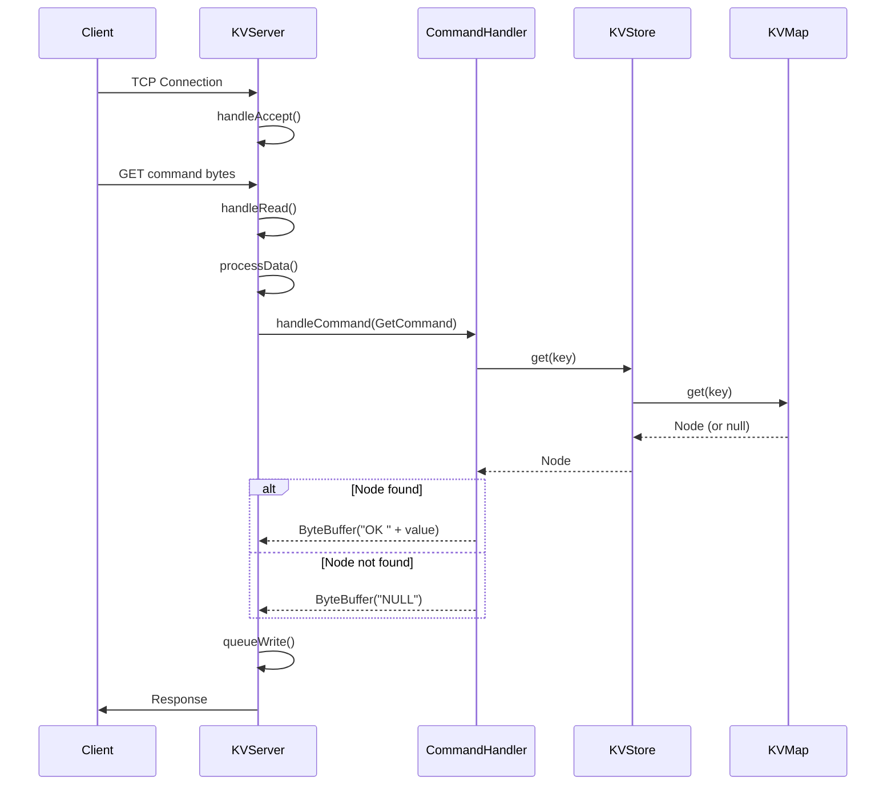

### GET Command Flow - Raft Mode

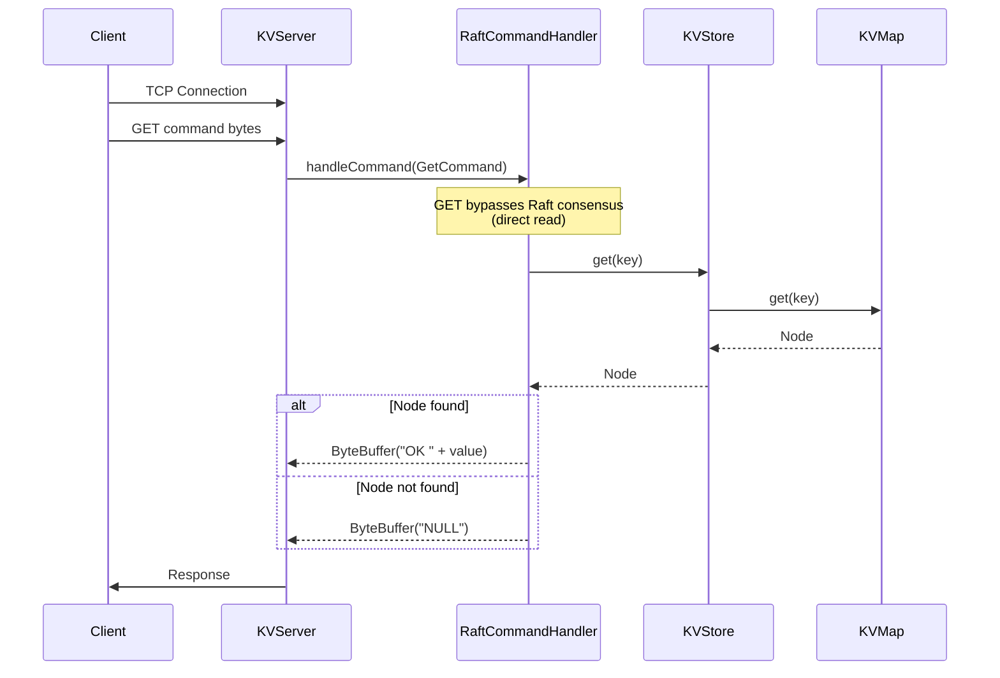

### PUT Command Flow - Single Node Mode

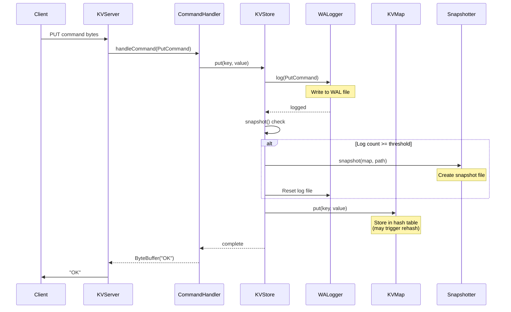

### PUT Command Flow - Raft Mode (Leader)

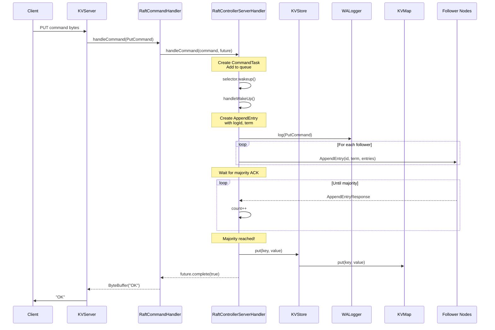

### PUT Command Flow - Raft Mode (Follower)

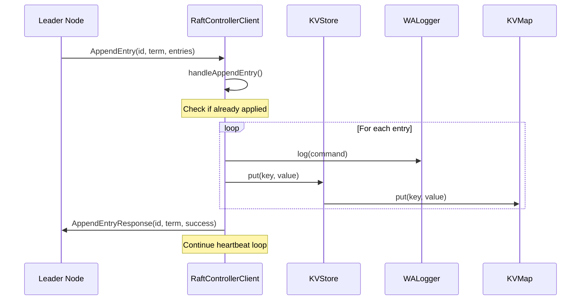

---

## Raft State Machine

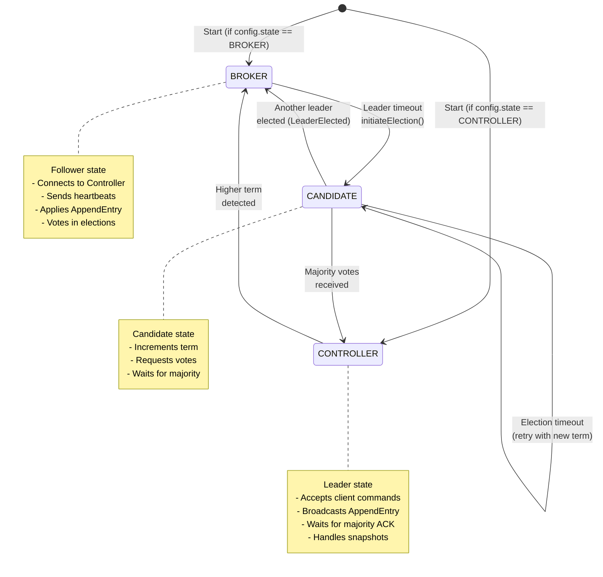

---

## Component Interactions

### Raft Cluster Architecture

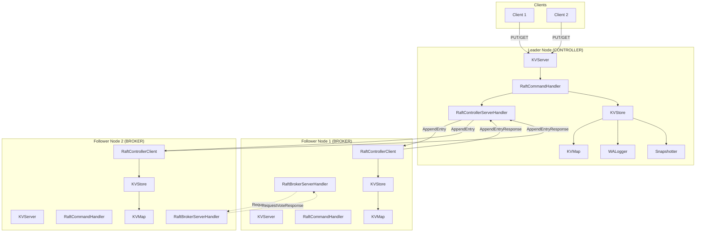

### Storage Layer Detail

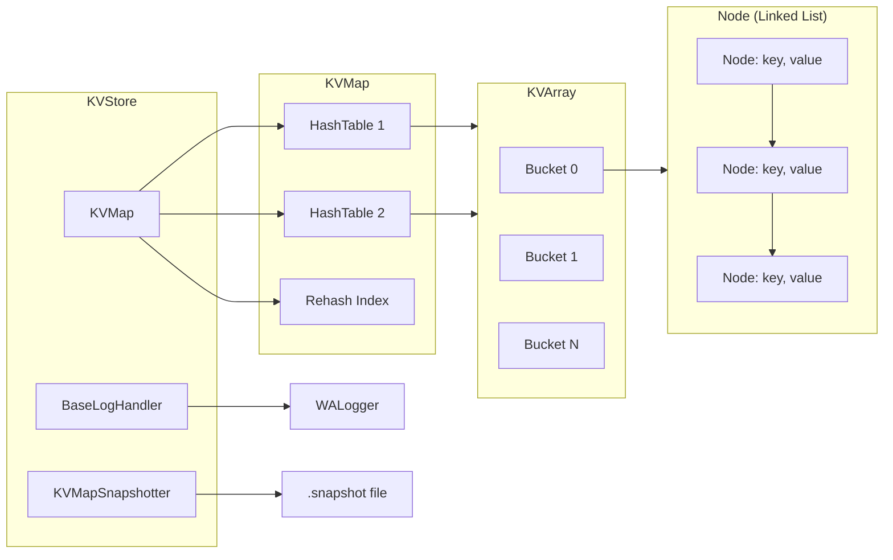

### Log Handler Hierarchy

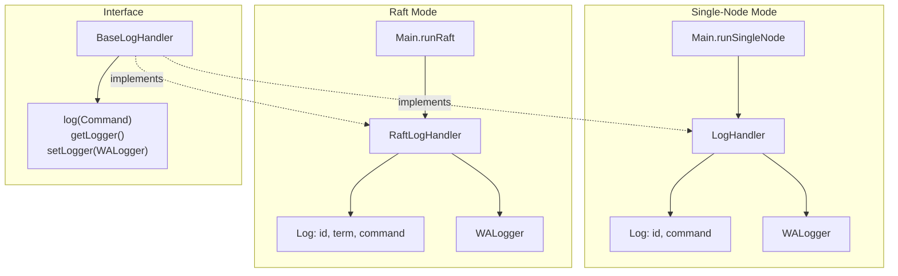

---

## Message Types

```mermaid
classDiagram
    class MessageType {
        <<enumeration>>
        REQUEST_ENTRY
        APPEND_ENTRY
        APPEND_ENTRY_RESPONSE
        INSTALL_SNAPSHOT
        HEARTBEAT_REQUEST
        HEARTBEAT_RESPONSE
        REQUEST_VOTE
        REQUEST_VOTE_RESPONSE
        LEADER_ELECTED
        ERROR
    }
    
    class AppendEntry {
        +long id
        +long term
        +List~Log~ entries
        Used by: Leader → Followers
        Purpose: Replicate log entries
    }
    
    class AppendEntryResponse {
        +long id
        +long term
        +boolean success
        Used by: Followers → Leader
        Purpose: Acknowledge replication
    }
    
    class RequestEntry {
        +long id
        +long term
        Used by: Follower → Leader
        Purpose: Request missing entries
    }
    
    class InstallSnapshot {
        +byte[] snapshot
        +long logId
        +long term
        Used by: Leader → Follower
        Purpose: Send snapshot to lagging follower
    }
    
    class RequestVote {
        +long term
        +long logId
        Used by: Candidate → All
        Purpose: Request vote during election
    }
    
    class RequestVoteResponse {
        +boolean voteGranted
        +long term
        Used by: All → Candidate
        Purpose: Grant/deny vote
    }
    
    class LeaderElected {
        +long leaderId
        +long term
        Used by: New Leader → All
        Purpose: Announce leadership
    }
    
    class HeartbeatRequest {
        Used by: Follower → Leader
        Purpose: Check leader health
    }
    
    class HeartbeatResponse {
        Used by: Leader → Follower
        Purpose: Confirm alive
    }
```

---

## Key Design Decisions

### 1. Dual Hash Table (Incremental Rehashing)

The `KVMap` uses two hash tables (`ht1` and `ht2`) for incremental rehashing, similar to Redis. This allows the store to
grow without blocking operations.

### 2. Write-Ahead Logging (WAL)

All mutations are logged before being applied, ensuring durability. In Raft mode, the log includes term and log ID for
consensus.

### 3. Snapshotting

Periodic snapshots compact the log and reduce recovery time. Snapshots are named with `logId_term.snapshot` format.

### 4. Non-blocking I/O

Both `KVServer` and Raft components use Java NIO with `Selector` for handling multiple concurrent connections
efficiently.

### 5. Raft Consensus

- **GET**: Direct read from local store (no consensus required)
- **PUT**: Requires majority acknowledgment before applying

### 6. Node States

- **BROKER**: Follower, connects to leader, applies replicated commands
- **CONTROLLER**: Leader, accepts client commands, coordinates replication
- **CANDIDATE**: Transitional state during leader election